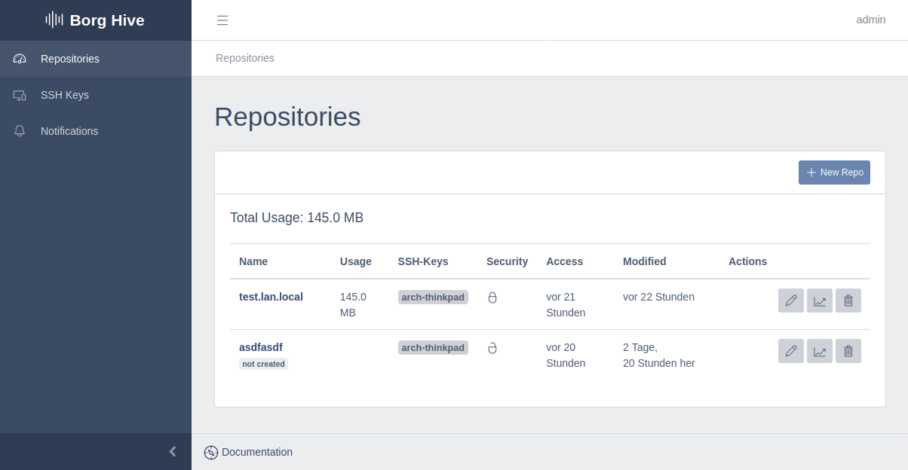

.. borg-hive documentation master file, created by
   sphinx-quickstart on Wed May  6 23:27:17 2020.
   You can adapt this file completely to your liking, but it should at least
   contain the root `toctree` directive.

Quick Start
===========

This chapter will get you started with Borg Hive.

Get started
-------------

**Installation**

- For a development setup look into :ref:`Development`
- For a brief test or a standalone installation look into :ref:`docker`
- For a more advanced approach or cloud installation look into the deployment to :ref:`k8s`

**First Usage**

Add or adjust your repository location in the admin interface, which is used to generate the borgbackup destination url: 
http://localhost:8000/admin/borghive/repositorylocation/

Add an SSH-Key to borg-hive which is needed to create a repository.

Create your first repository and do a backup. Besides plain borgbackup it also works well with `borgmatic <https://github.com/witten/borgmatic>`_ or `vorta <https://github.com/borgbase/vorta>`_.
